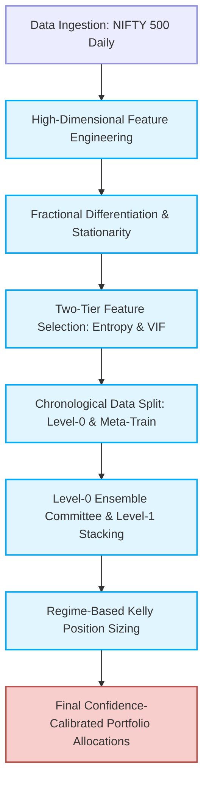
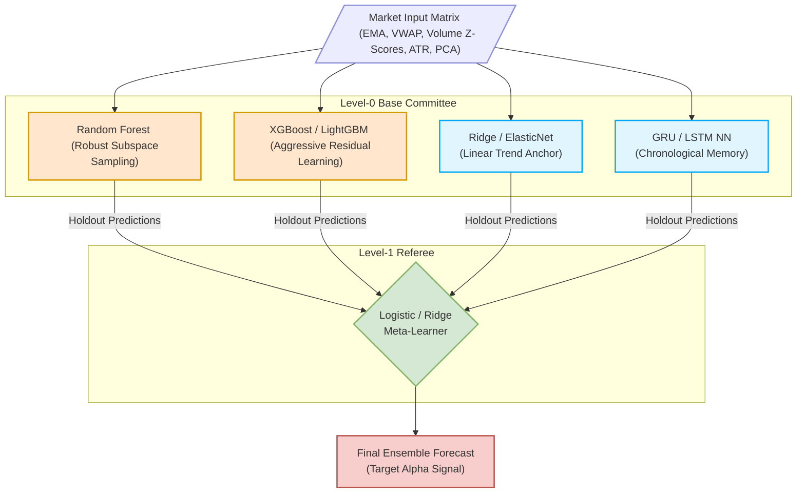
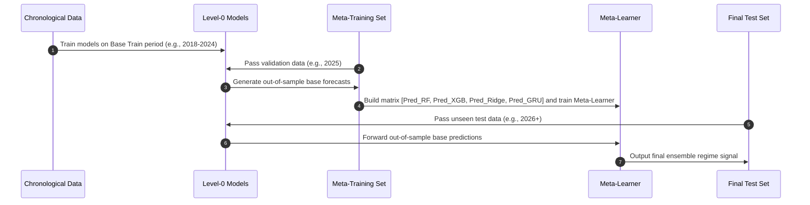

# Institutional-Grade Multi-Horizon Ensemble Alpha Engine: Architectural & Operational Blueprint

## 1. Executive Summary & Objective

The objective of this blueprint is to design and implement an institutional-grade quantitative trading pipeline to generate alpha across the **NIFTY 500** universe. The engine forecasts directional market regimes over two distinct chronological horizons (1-day and 5-day) and translates these forecasts into automated, risk-adjusted, and confidence-calibrated position sizes.



---

## 2. Functional Requirements & Target Framework

* **Data Universe:** All 500 active constituents of the NIFTY 500, updated and ingested daily.
* **Predictive Targets:**
  * **One-Day Horizon ($T+1$):** Regressed return from the next trading day's open ($Open_{t+1}$) to its close ($Close_{t+1}$).
  * **Five-Day Horizon ($T+5$):** Cumulative return from the next trading day's open ($Open_{t+1}$) to the fifth day's close ($Close_{t+5}$).

---

## 3. Engineering & Statistical conditioning

To ensure robust predictive signaling, raw indicators are transformed into stationary, independent predictors:

```
                  +-----------------------------------+
                  |   Raw Features (>200 Indicators)  |
                  +-----------------------------------+
                                    |
                                    v
                  +-----------------------------------+
                  | Fractional Differentiation (d)    | <-- Preserves memory, ensures stationarity
                  +-----------------------------------+
                                    |
                                    v
                  +-----------------------------------+
                  |   Principal Component Analysis    | <-- Extracts orthogonal factor dynamics
                  +-----------------------------------+
                                    |
                                    v
                  +-----------------------------------+
                  |        Entropy Screening          | <-- Filters out noisy, low-entropy indicators
                  +-----------------------------------+
                                    |
                                    v
                  +-----------------------------------+
                  |       VIF Multi-collinearity      | <-- Ensures independent, low-correlation inputs
                  +-----------------------------------+
```

### Stationarity Preservation via Fractional Differentiation
Standard integer differentiation (e.g., computing simple returns) removes all historical memory, leaving features with reduced predictive power. We apply fractional differentiation to find the optimal order $d \in (0, 1)$ that achieves stationarity while retaining maximum long-term memory:
$$(1-B)^d = \sum_{k=0}^{\infty} (-1)^k \binom{d}{k} B^k$$

### Two-Tier Feature Selection
1. **Tier 1: Entropy Screening:** We evaluate the mutual information and Shannon entropy of all features against the target variables, dropping columns that fall below the information threshold.
2. **Tier 2: Variance Inflation Factor (VIF) Filtering:** To prevent linear dependency issues, we sequentially remove features with high multi-collinearity until all remaining features satisfy:
$$\text{VIF}_j = \frac{1}{1 - R_j^2} < 5.0$$

---

## 4. Modeling Layers & Stacking Architecture

We employ a **Stacked Generalization (Stacking)** framework. Level-0 base models are designed with diverse inductive biases to capture linear, non-linear, and sequential components of the market.



### Level-0 Committee Diversity
* **Random Forest (Bagging):** Reduces variance and models complex, orthogonal features via random feature bootstrapping.
* **XGBoost/LightGBM (Boosting):** Minimizes bias by learning sequentially from structural residuals.
* **Ridge/ElasticNet (Linear Model):** Acts as a low-variance linear regularizer, anchoring the ensemble in periods where non-linear patterns degrade.
* **GRU/LSTM (RNN):** Captures sequence-dependent, path-dependent temporal signatures. *Guardrail: GRU structures must incorporate recurrent dropout ($P_{dropout} \ge 0.2$) to mitigate time-series overfitting.*

---

## 5. Temporal Stacking & Validation Strategy

To prevent look-ahead bias and information leakage, the data partitioning relies strictly on chronological splits. No random shuffling or standard K-fold splits are permitted.

```
Total Backtest & Deployment Horizon (e.g., 2018 - 2026+)
+-----------------------------------+--------------------+--------------------+
|        Level-0 Base Train         |   Meta-Training    |     Final Test     |
|           (2018 - 2024)           |  (Holdout - 2025)  |  (Inference-2026+) |
+-----------------------------------+--------------------+--------------------+
```

### 1. Data Split Architecture
| Partition | Target Time Window | Purpose |
| :--- | :--- | :--- |
| **Level-0 Base Train** | e.g., 2018 – 2024 | Train the Level-0 models (RF, XGB, Ridge, GRU). Perform inner validation splits for hyperparameter tuning. |
| **Meta-Training (Holdout)** | e.g., 2025 | Generate out-of-sample base model predictions. Fit the Level-1 Meta-Learner. |
| **Final Test Set** | e.g., 2026+ | Out-of-sample production simulation and final performance validation. |

### 2. Operational Implementation Flow



---

## 6. Confidence-Based Position Sizing

The Meta-Learner functions as a **Confidence Referee**. Instead of generating raw return point forecasts, it maps predictions to a multi-class regime model (e.g., $\text{Regime} \in \{\text{Bearish}, \text{Neutral}, \text{Bullish}\}$).

### The Volatility-Adjusted Kelly Criterion
To scale the size of individual positions within the NIFTY 500, we apply a volatility-adjusted Kelly formula:
$$\text{Raw Position Size}_i = \text{Target Volatility} \times \frac{\mathbb{E}[R_i]}{\sigma_i^2}$$

Where:
* $\mathbb{E}[R_i]$ is the predicted regime expected return.
* $\sigma_i^2$ is the volatility estimate (e.g., rolling Exponential Weighted Moving Average or GARCH(1,1) variance).

### Confidence-Calibration Filter
The final position size for asset $i$ is scaled directly by the probability distribution output of the Meta-Learner:
$$\text{Final Position Size}_i = \text{Raw Position Size}_i \times P(\text{Regime}_i) \times S(\text{Confidence}_i)$$

Where $S(\cdot)$ is a Sigmoid activation squashing function designed to prevent portfolio concentration:
$$S(x) = \frac{1}{1 + e^{-k(x - x_0)}}$$

---

## 7. Operational Guardrails & Technical Checklist

> [!WARNING]
> ### 1. Chronological Partitioning Integrity
> Never apply global scaling, mean imputation, or standardization across the entire dataset. Scalers (e.g., StandardScaler or RobustScaler) and fractional differentiation coefficients must be fit **strictly** on the Level-0 Base Train dataset and applied out-of-sample to the Holdout and Test partitions.

> [!IMPORTANT]
> ### 2. Temporal Embargoing
> Because features contain memory (moving averages, fractionally differentiated values), you must apply an **embargo** period of at least 5 days at the boundary between the Level-0 Train and Meta-Training sets. This prevents data from the Meta-Training set leaking back into the Level-0 training features.

| Component | Technical Guardrail Tasks | Status |
| :--- | :--- | :---: |
| **Data Ingestion** | Store and freeze fractional differentiation constants ($d$, weights, lookback window). | `[ ]` |
| **Data Split** | Implement chronological split parameters, guaranteeing no random index shuffling. | `[ ]` |
| **Level-0 Committee** | Apply feature subspacing to ensure tree-based models and RNNs receive diverse input matrices. | `[ ]` |
| **Meta-Learner** | Verify that Meta-Learner features are derived *only* from out-of-sample validation predictions. | `[ ]` |
| **Position Sizing** | Implement maximum portfolio concentration limits ($\le 5\%$ allocation per constituent). | `[ ]` |
| **Validation** | Replace standard accuracy metrics with Precision-Recall AUC to handle return distribution imbalances. | `[ ]` |